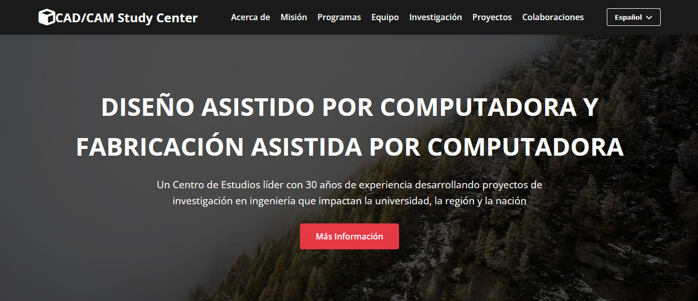
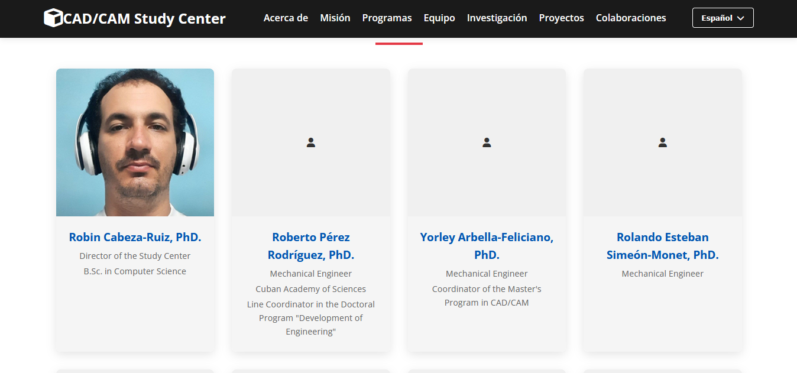
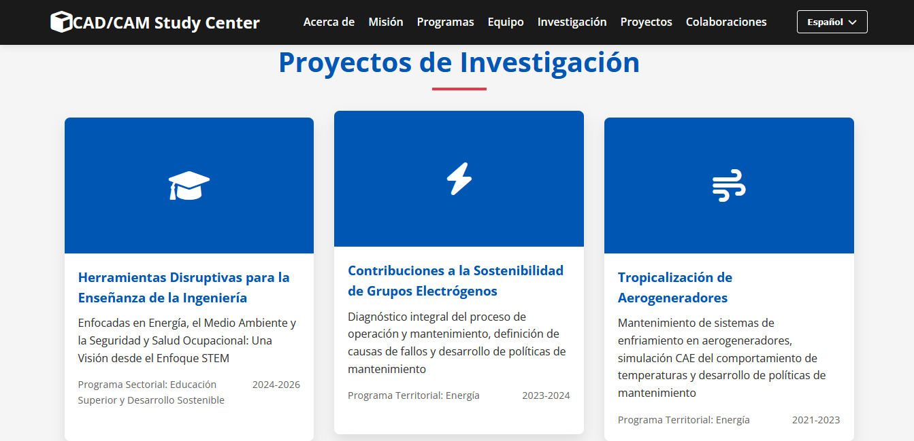

# CAD/CAM Study Center - University of Holguín

A modern, responsive website for the CAD/CAM Study Center at the University of Holguín, Cuba, featuring multilingual support and comprehensive information about the center's research, team, and academic programs.

## 🌐 Live Demo

Visit the website at: [https://cecadcam-uho.netlify.app/](https://cecadcam-uho.netlify.app/)

## 📸 Screenshots





## ✨ Features

- **Responsive Design**: Works seamlessly on desktop, tablet, and mobile devices
- **Multilingual Support**: Available in English, Spanish, Russian, and Chinese
- **Modern UI/UX**: Clean, professional design with smooth animations
- **Team Showcase**: Profiles of all center members with images
- **Research Projects**: Detailed information about all ongoing research projects
- **Academic Programs**: Information about undergraduate and postgraduate studies
- **International Collaborations**: Showcase of global partnerships
- **Smooth Navigation**: Intuitive menu with smooth scrolling between sections

## 🛠 Technologies Used

- **HTML5**: Semantic markup structure
- **CSS3**: Modern styling with custom properties and responsive grid layouts
- **JavaScript (ES6+)**: Interactive features and language switching
- **Font Awesome**: Icon library for UI elements
- **Google Fonts**: Typography for improved readability

## 🚀 Getting Started

To get a local copy up and running, follow these simple steps:

### Prerequisites

- A modern web browser
- A local web server (optional but recommended)

### Installation

1. Clone the repository:
   ```bash
   git clone https://github.com/robbinc91/cecadcam-info.git
   ```

2. Navigate to the project directory:
   ```bash
   cd cecadcam-info
   ```

3. Open `index.html` in your browser or serve it with a local web server:
   ```bash
   # Using Python 3
   python -m http.server 8000
   
   # Using Node.js (if you have http-server installed)
   http-server
   
   # Using PHP
   php -S localhost:8000
   ```

4. Open your browser and navigate to `http://localhost:8000`

## 📁 Project Structure

```
cadcam-study-center/
├── index.html          # Main HTML file
├── css/                # Stylesheets
│   └── style.css       # Main stylesheet
├── js/                 # JavaScript files
│   └── script.js       # Main JavaScript file
├── images/             # Image assets
│   ├── team/           # Team member photos
│   ├── projects/       # Project-related images
│   └── ui/             # UI elements and icons
├── README.md           # This file
└── LICENSE             # License file
```

## 🌍 Language Support

The website supports four languages:
- English (default)
- Spanish (Español)
- Russian (Русский)
- Chinese (中文)

The language preference is saved in localStorage and will persist across sessions.

## 📝 About the CAD/CAM Study Center

The CAD/CAM Study Center at the University of Holguín is the first and only center of its kind within Cuba's Ministry of Higher Education. Founded in 1985 as a research group and becoming an official center in 1989, it has 30 years of experience developing engineering research projects that impact the university, the region, and the nation.

The center's mission is to provide high-quality undergraduate and postgraduate education and to apply research to solving scientific-technical problems through a strong university-community partnership and a team of experts with solid scientific training in CAD/CAM/CAE technologies.

## 🤝 Contributing

Contributions are what make the open-source community such an amazing place to learn, inspire, and create. Any contributions you make are **greatly appreciated**.

If you have a suggestion that would make this better, please fork the repo and create a pull request. You can also simply open an issue with the tag "enhancement".

1. Fork the Project
2. Create your Feature Branch (`git checkout -b feature/AmazingFeature`)
3. Commit your Changes (`git commit -m 'Add some AmazingFeature'`)
4. Push to the Branch (`git push origin feature/AmazingFeature`)
5. Open a Pull Request

## 📄 License

This project is open source.


⭐ If you like this project, please give it a star!